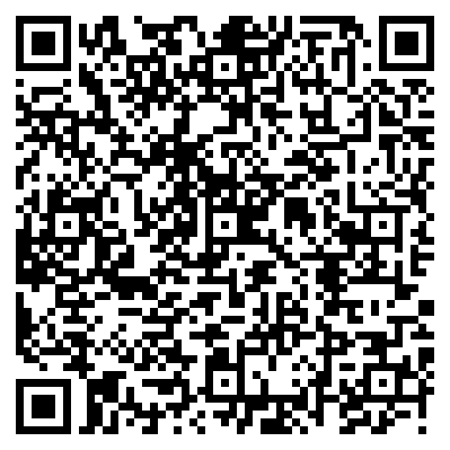

*[Leia em português (BR)](README.md)*

# IR remote codes — AUN ET30 projector

> Lost, broken, or missing the remote for your **AUN ET30** mini
> projector (or a compatible model — AUN ET40C, A30, A30C, ET40,
> ET30S, Artlii YG600, YG620, YG220, AKEY7)? Before buying a universal
> or replacement remote, check if these IR codes solve it — they work
> with a Tuya Smart IR Hub, Flipper Zero, LIRC, or any generic NEC
> transmitter (Arduino, ESPHome, Tasmota).

Complete map of the infrared codes for the remote control that ships
with the **AUN ET30** mini projector. These codes were **not
documented anywhere public** before this repository (no hits in the
best-known IR databases — irdb, Flipper-IRDB, RemoteCentral — nor in
forums) and were obtained through reverse engineering, with a fair
amount of trial and error.

If your remote **looks the same** (same button layout, same generic
mini projector sold under different rebranded names — common with
cheap AliExpress/Amazon projectors) and these codes work on your
unit, **open an issue or PR** with your projector's brand/model — it
helps map the family of devices sharing this same remote chip. See
[CONTRIBUTING.md](CONTRIBUTING.en.md).

## Possibly compatible models (unverified)

The only unit I actually have to test with is the **AUN ET30**, so the
codes above are confirmed on that one alone. However, I found
replacement-remote listings advertised as compatible with several
models at once, which suggests they share the same chip/command
layout:

- [Remote Control for AUN ET40C A30 A30C ET40 ET30 ET30S / Artlii YG600 US-YG600B YG620 YG220 (Amazon)](https://www.amazon.com/dp/B0DK75XS2R)
- [Remote Control For AUN ET40C A30 A30C ET40 ET30 ET30S AKEY7 (eBay)](https://www.ebay.com/itm/176633915628)

Models mentioned in those listings: **AUN ET40C, A30, A30C, ET40,
ET30S**, **Artlii YG600, US-YG600B, YG620, YG220**, **AKEY7**. If you
own one of these and the codes work (or don't), please open an issue —
that's what actually confirms (or rules out) compatibility.

## Protocol

- **Protocol:** standard NEC, 32 bits (address + ~address + command +
  ~command), 38 kHz carrier.
- **Address:** `0x00` on all buttons.
- **Real measured timings:** leader mark `8889µs`, leader space
  `4513µs`, bit mark `563µs`, `0`-bit space `563µs`, `1`-bit space
  `1703µs`, stop mark `563µs`.

> **Applicability note:** the NEC "textbook" timings
> (9000/4500/560/1690µs) also decode these signals correctly on most
> receivers (tolerance covers the difference), but some stricter
> transmitters/receivers only accept the **exact, measured** timings
> above. If your implementation doesn't react with the standard
> values, use the real measured ones. This repository's reference
> encoder (`nec_encoder.py`) already generates the correct output
> using these real timings — validated byte-for-byte against a
> verbatim capture from the physical remote.

## Code table

All at address `0x00`. Full NEC code = `00FF` + command + `~command`.

| Button | Command (hex) | Full NEC code |
|---|---|---|
| POWER | `0xA8` | `0x00FFA857` |
| BACK | `0xA4` | `0x00FFA45B` |
| OK | `0x9E` | `0x00FF9E61` |
| VOLUME- | `0x9C` | `0x00FF9C63` |
| LEFT (arrow) | `0x9B` | `0x00FF9B64` |
| DOWN (arrow) | `0x9A` | `0x00FF9A65` |
| RIGHT (arrow) | `0x99` | `0x00FF9966` |
| REWIND | `0x98` | `0x00FF9867` |
| INPUT / SOURCE | `0x97` | `0x00FF9768` |
| UP (arrow) | `0x95` | `0x00FF956A` |
| PLAY/PAUSE | `0x93` | `0x00FF936C` |
| MENU | `0x91` | `0x00FF916E` |
| VOLUME+ | `0x8C` | `0x00FF8C73` |
| MUTE | `0x88` | `0x00FF8877` |
| FORWARD | `0x82` | `0x00FF827D` |

Note that the command bytes don't follow the buttons' physical layout
or any obvious logical grouping — the numbering is the remote chip's
scan matrix order, not something you can deduce from the outside.

## Ready-to-use formats

- [`AUN_ET30.ir`](AUN_ET30.ir) — **Flipper Zero** format (native NEC protocol).
- [`AUN_ET30.lircd.conf`](AUN_ET30.lircd.conf) — **LIRC** format (`lircd.conf`).
- [`codebook.json`](codebook.json) — includes each button's NEC hex
  plus the Tuya API's specific binary payload (used by this repo's
  CLI).

Any tool that accepts raw NEC (Arduino + `IRremote`, ESPHome, Tasmota,
generic capture/replay tools) can use the values in the table above
directly — address `0x00`, command per the column.

## Tools in this repository

Besides the code map, this repository includes:

- `nec_encoder.py` / `nec_decoder.py` — encode/decode NEC ↔ Tuya's
  binary format, using the real measured timings above. Run
  `python3 nec_encoder.py` and `python3 nec_decoder.py` to see the
  round-trip self-test.
- A **full Python CLI** for anyone using a Tuya Smart IR Hub via the
  Cloud API (learn, send, and import codes). Not needed if you just
  want the codes — see [TUYA_CLI.md](TUYA_CLI.en.md) if that's your
  case.

## Support this project

If these codes saved you from buying a new remote (or tossing the
projector), consider buying me a coffee:

- **GitHub Sponsors**: [github.com/sponsors/jeffdomingos](https://github.com/sponsors/jeffdomingos)
- **PIX** (Brazilian instant payment, random key): `bed24680-2ead-40e3-9aef-73a1601a6399`

  

## License

[MIT](LICENSE).
